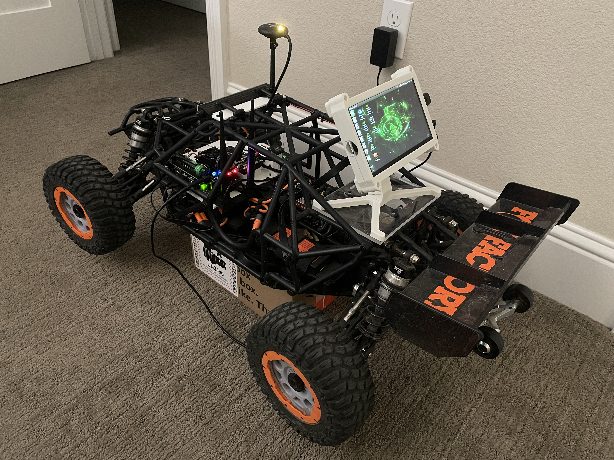

# Ardupilot Rover Build

### Hardware
- Base Vehicle: [Losi DBXL-E 2.0](https://www.losi.com/product/1-5-dbxl-e-2.0-4x4-desert-buggy-brushless-rtr-with-smart-fox/LOS05020V2T1.html)

- Flight Controller: [Pixhawk 6C](https://www.getfpv.com/holybro-pixhawk-6c-pm07-power-module-m8n-gps.html)

- Companion Computer: [Jetson Nano 4GB](https://developer.nvidia.com/embedded/jetson-nano-developer-kit)
    - Power Module: [18650 Single Cell Li-Ion Shield](https://a.co/d/eSGOiVn)

- Camera: [OAK-D-Lite](https://shop.luxonis.com/products/oak-d-lite-1?variant=42583102456031)

Examples from: https://github.com/luxonis/depthai-python/tree/main/examples

