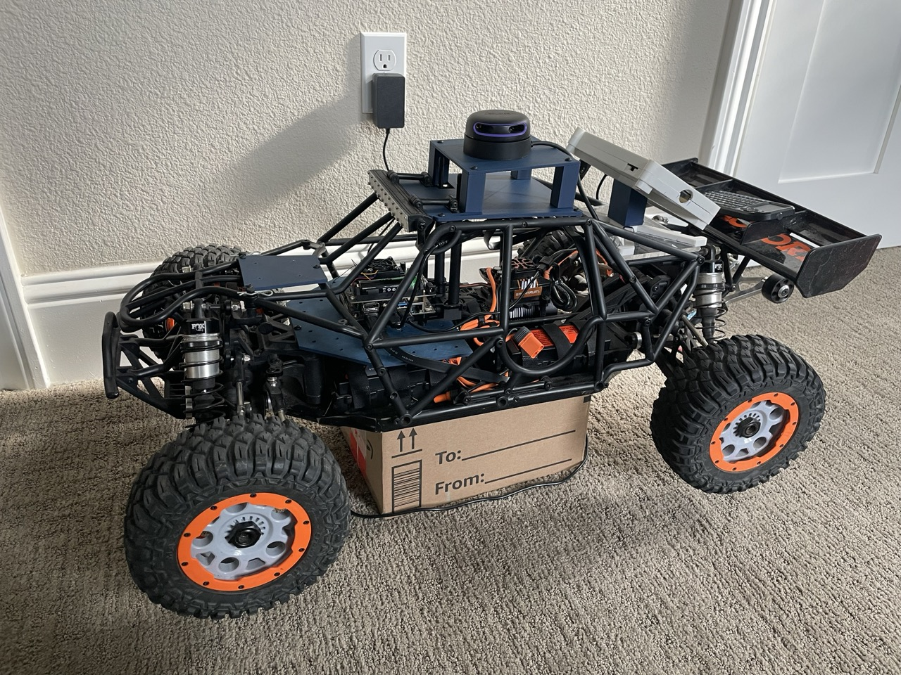

# ROS Rover Build (Work In Progress)

- TODOs:
    - Convert repo to ROS workspace
    - [setup PS4 controller drivers](http://wiki.ros.org/ds4_driver)
    - compile depthai ros nodes

# 3D Print Files
- [Printables](https://www.printables.com/model/648445-losi-dbxl-e-20-robotics-build)

# Hardware
- Base Vehicle: [Losi DBXL-E 2.0](https://www.losi.com/product/1-5-dbxl-e-2.0-4x4-desert-buggy-brushless-rtr-with-smart-fox/LOS05020V2T1.html)

- Computer: [Jetson Nano 4GB](https://developer.nvidia.com/embedded/jetson-nano-developer-kit)
    - Power Module: [18650 Single Cell Li-Ion Shield](https://a.co/d/eSGOiVn)

- PCA9685 PWM Driver: [Adafruit 16-Channel 12-bit PWM/Servo Driver](https://www.adafruit.com/product/815)

- LiDAR: [RPLidar A2M12](https://www.slamtec.com/en/Lidar/A2/)

- Camera: [OAK-D-Lite](https://shop.luxonis.com/products/oak-d-lite-1?variant=42583102456031)

    - examples from: https://github.com/luxonis/depthai-python/tree/main/examples

---
# Build Pictures
ROS Build (Current):

ArduRover build (Old):
